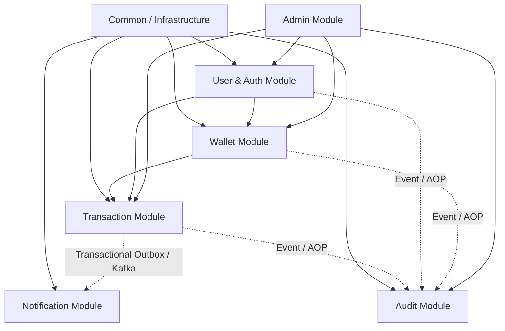

# KẾ HOẠCH TRIỂN KHAI HỆ THỐNG E-WALLET / DIGITAL BANKING PLATFORM (V1.0)

> **Tài liệu tham chiếu:** `E_Wallet_Business_Requirements_v1.0.docx` & `V1__init_schema.sql`  
> **Kiến trúc:** Modular Monolith (Spring Boot 3/4 + Java 17 + PostgreSQL)  
> **Công nghệ mở rộng:** Redis, Kafka, Transactional Outbox, Docker, Testcontainers  

---

## 1. TỔNG QUAN KIẾN TRÚC & NGUYÊN TẮC THIẾT KẾ

### 1.1. Kiến trúc Modular Monolith
Hệ thống đóng gói trong một ứng dụng Spring Boot duy nhất nhưng chia rõ ranh giới các module độc lập. Mỗi module có cấu trúc:
- `entity`: Thực thể JPA ánh xạ DB schema.
- `repository`: Truy vấn dữ liệu qua Spring Data JPA.
- `service` / `service.impl`: Nghiệp vụ nội bộ module.
- `dto` (request/response): Đối tượng trao đổi dữ liệu.
- `controller`: REST APIs của module.
- `event`: Domain events dùng để giao tiếp bất đồng bộ giữa các module.

```
com.ewallet
├── common          # Infrastructure dùng chung: Exception, ApiResponse, Outbox, Idempotency, Redis
├── user            # Quản lý tài khoản, Authentication, JWT, Roles, OTP
├── wallet          # Quản lý ví, số dư, khóa số dư (Pessimistic Locking), sao kê (Statement)
├── transaction     # Nghiệp vụ nạp (Deposit), rút (Withdraw), chuyển tiền (Transfer)
├── notification    # Lưu trữ & gửi thông báo cho người dùng
├── audit           # Ghi vết hành vi hệ thống (Audit Trail)
└── admin           # APIs quản trị, thống kê dashboard, kiểm duyệt
```

### 1.2. Biểu đồ phụ thuộc giữa các Module (Dependency Graph)



---

## 2. THỨ TỰ TRIỂN KHAI CÁC MODULE (PHASE-BY-PHASE ROADMAP)

Để đảm bảo code chạy được ngay, kiểm thử liên tục và không bị vòng lặp phụ thuộc (circular dependency), thứ tự triển khai chuẩn xác như sau:

| Giai đoạn | Module | Trọng tâm nghiệp vụ | Kết quả bàn giao |
| :--- | :--- | :--- | :--- |
| **Phase 1** | **Common (Foundation)** | Chuẩn hóa Response, Global Exception, Base Entities, Configs | Sẵn sàng khung chuẩn cho toàn bộ API |
| **Phase 2** | **User & Auth** | JWT, Security Filter Chain, Register, Login, RBAC, User Profile | Đăng ký, đăng nhập lấy Access/Refresh token |
| **Phase 3** | **Wallet** | Tạo ví khi User đăng ký, Tra cứu ví, Khóa Pessimistic Lock, Statement | Ví mặc định 0 VND, sẵn sàng nạp/rút |
| **Phase 4** | **Transaction (Deposit & Withdraw)** | Nạp tiền, Rút tiền đơn điểm, Atomic balance update, Sinh mã Reference | Nạp tiền tăng số dư, rút tiền trừ số dư an toàn |
| **Phase 5** | **Transaction (Transfer Core)** | Chuyển tiền giữa 2 ví, Chống Deadlock, Idempotency Filter/Service | Chuyển tiền nguyên tử (Atomic), chống double-spending |
| **Phase 6** | **Outbox & Message Broker** | Transactional Outbox Worker, Kafka Producer/Consumer, Redis Caching | Bắn event giao dịch bất đồng bộ đáng tin cậy |
| **Phase 7** | **Notification & Audit Log** | Xử lý thông báo biến động số dư qua Kafka, ghi log hành vi kiểm toán | User nhận thông báo, Admin có lịch sử audit |
| **Phase 8** | **Admin & Reporting** | Khóa/Mở User, Freeze/Unfreeze Wallet, Dashboard thống kê | Hệ thống vận hành và quản trị đầy đủ |
| **Phase 9** | **Testing, Stress Test & Docker** | Concurrency Test (50-100 threads), Testcontainers, Docker Compose | Hệ thống sẵn sàng đóng gói và triển khai |

---

## 3. CHI TIẾT CÁC BƯỚC TRIỂN KHAI TỪNG MODULE

### Phase 1: Common / Foundation Infrastructure
- [x] **1.1. Chuẩn hóa Định dạng Response:**
  - `ApiResponse<T>`: format chuẩn `{ success, code, message, data, timestamp }`.
  - `PageResponse<T>`: format chuẩn hỗ trợ phân trang `{ content, page, size, totalElements, totalPages, isLast }`.
- [x] **1.2. Quản lý Lỗi tập trung (Global Exception Handling):**
  - Enum `ErrorCode` định nghĩa mã lỗi nghiệp vụ, HTTP Status, message đa dạng bao quát toàn bộ domain.
  - Custom `AppException(ErrorCode)`.
  - `@RestControllerAdvice` (`GlobalExceptionHandler`) bắt toàn diện các ngoại lệ: `AppException`, `MethodArgumentNotValidException`, `ConstraintViolationException`, `HttpMessageNotReadableException`, `AccessDeniedException`, `BadCredentialsException`, `Exception`.
- [x] **1.3. Base Configs:**
  - JPA Auditing (`@EnableJpaAuditing` trong `JpaAuditingConfig`).

---

### Phase 2: User & Authentication Module
- [x] **2.1. Security & JWT Engine:**
  - Password Encoder (`BCryptPasswordEncoder`).
  - `JwtTokenProvider`: Tạo, parse, validate JWT bằng JJWT 0.12.x (Access Token hạn ngắn 30 phút, Refresh Token hạn dài 7 ngày).
  - `JwtAuthenticationFilter`: Đọc header `Authorization: Bearer <token>`, trích xuất Claims, set vào `SecurityContextHolder`.
  - `JwtAuthenticationEntryPoint` & `CustomAccessDeniedHandler`: Chuẩn hóa 401 & 403 response dạng JSON.
  - `SecurityConfig`: Cấu hình stateless session, CORS, phân quyền endpoint theo Roles (`USER`, `ADMIN`).
- [x] **2.2. Authentication Service & APIs:**
  - `POST /auth/register`:
    - Validate email, phone, password.
    - Mã hóa password bằng BCrypt, gán role `USER`.
    - **Thực thi nghiệp vụ BR-01:** Sau khi tạo user, kích hoạt tạo ngay 1 Wallet mặc định (balance = 0, currency = VND, status = ACTIVE).
  - `POST /auth/login`: Xác thực thông tin, kiểm tra trạng thái khóa (LOCKED), trả về Access Token + Refresh Token + User profile.
  - `POST /auth/refresh-token`: Cấp mới Access Token bằng Refresh Token hợp lệ.
  - `POST /auth/logout`: Endpoint đăng xuất.
- [x] **2.3. User Profile & Admin Management APIs:**
  - `GET /users/me`: Xem thông tin tài khoản hiện tại qua token.
  - `PUT /users/me`: Cập nhật họ tên, số điện thoại (kiểm tra trùng lặp).
  - `GET /admin/users`: Admin tra cứu danh sách người dùng kèm phân trang, lọc theo trạng thái/email/tên.
  - `PATCH /admin/users/{id}/status`: Admin khóa (`LOCKED`) hoặc mở khóa (`ACTIVE`) người dùng.

---

### Phase 3: Wallet Module
- [ ] **3.1. Wallet Core Service & Repository:**
  - `WalletRepository`:
    - Tìm ví theo `userId`.
    - **Pessimistic Lock Query:** `@Lock(LockModeType.PESSIMISTIC_WRITE)` `findById(UUID id)` hoặc `findByUserId(UUID userId)` để khóa dòng dữ liệu trong DB khi thao tác tiền, loại trừ tuyệt đối xung đột đa luồng.
- [ ] **3.2. Wallet Business Rules (BR-01, BR-02, BR-05):**
  - Hàm tạo ví mặc định khi đăng ký: `createDefaultWallet(User user)`.
  - Kiểm tra trạng thái ví (`ACTIVE`, `FROZEN`, `CLOSED`). Nếu không `ACTIVE`, quăng lỗi `WALLET_NOT_ACTIVE`.
  - Kiểm tra số dư: balance >= amount trước khi trừ.
- [ ] **3.3. Wallet Statement Service:**
  - Ghi nhận biến động số dư vào bảng `wallet_statements`:
    - `wallet_id`, `transaction_id`, `entry_type` (`CREDIT` hoặc `DEBIT`).
    - `amount`, `balance_after`, `created_at`.
- [ ] **3.4. Wallet APIs:**
  - `GET /wallets/my-wallet`: Xem thông tin ví, số dư và trạng thái của user đang đăng nhập.
  - `GET /wallets/statements`: Xem lịch sử biến động số dư (hỗ trợ phân trang và sắp xếp).
  - `PATCH /admin/wallets/{id}/freeze`: Admin đóng băng ví.
  - `PATCH /admin/wallets/{id}/unfreeze`: Admin mở đóng băng ví.

---

### Phase 4: Transaction Module - Deposit & Withdraw
- [ ] **4.1. Core Utilities:**
  - Sinh mã giao dịch duy nhất `reference` (ví dụ: `TXN-yyyyMMddHHmmss-XXXXXX` với nano time / SecureRandom).
- [ ] **4.2. Deposit Flow (Nạp tiền):**
  - Request: `amount`, `description`.
  - Validate: `amount > 0`.
  - Transaction DB (`@Transactional`):
    1. Khóa ví người nhận (Pessimistic Lock).
    2. Kiểm tra ví `ACTIVE`.
    3. Tăng số dư: `wallet.balance += amount`.
    4. Tạo `Transaction` record: type = `DEPOSIT`, sender = `null`, receiver = `wallet`, status = `SUCCESS`.
    5. Tạo `WalletStatement`: entry_type = `CREDIT`.
- [ ] **4.3. Withdraw Flow (Rút tiền):**
  - Request: `amount`, `description`.
  - Validate: `amount > 0`.
  - Transaction DB (`@Transactional`):
    1. Khóa ví người rút (Pessimistic Lock).
    2. Kiểm tra ví `ACTIVE`.
    3. Kiểm tra số dư: nếu `balance < amount` -> ném ngoại lệ `INSUFFICIENT_BALANCE` (hoặc tạo transaction `FAILED` và rollback).
    4. Giảm số dư: `wallet.balance -= amount`.
    5. Tạo `Transaction` record: type = `WITHDRAW`, sender = `wallet`, receiver = `null`, status = `SUCCESS`.
    6. Tạo `WalletStatement`: entry_type = `DEBIT`.

---

### Phase 5: Core Transfer Flow with Concurrency & Idempotency
- [ ] **5.1. Luồng Chuyển tiền Nguyên tử (Atomic Transfer Flow - Section 15):**
  - Request: `receiverWalletId` (hoặc email/phone người nhận), `amount`, `description`. Header: `Idempotency-Key`.
  - Business Rules kiểm tra trước khi khóa:
    - `BR-03`: `amount > 0`.
    - `BR-04`: `senderWalletId != receiverWalletId` (Không cho phép tự chuyển cho chính mình).
  - **Kỹ thuật chống Deadlock (Deadlock Prevention):**
    - Khi cần khóa 2 ví cùng lúc, sắp xếp thứ tự lock theo `UUID` (Ví dụ: `UUID_1.compareTo(UUID_2) < 0` thì lock ví có ID nhỏ trước, ID lớn sau). Đảm bảo mọi transaction đồng thời đều lấy lock theo cùng một chiều, loại bỏ nguy cơ Deadlock 100%.
  - Luồng xử lý trong `@Transactional`:
    1. Lock Sender Wallet & Receiver Wallet theo thứ tự sắp xếp.
    2. Kiểm tra trạng thái cả 2 ví phải là `ACTIVE` (BR-02).
    3. Kiểm tra số dư người gửi: `senderWallet.balance >= amount` (BR-05).
    4. Debit Sender: `senderWallet.balance -= amount`.
    5. Credit Receiver: `receiverWallet.balance += amount`.
    6. Tạo `Transaction` (type = `TRANSFER`, status = `SUCCESS`).
    7. Tạo 2 `WalletStatement`:
       - Statement 1 cho Sender (DEBIT, `balance_after` mới).
       - Statement 2 cho Receiver (CREDIT, `balance_after` mới).
    8. Tạo `OutboxEvent` (aggregate_type = `TRANSACTION`, event_type = `TRANSACTION_COMPLETED`).
- [ ] **5.2. Cơ chế Idempotency (BR-08):**
  - Interceptor hoặc Filter bắt header `Idempotency-Key`:
    - Tạo `request_hash = SHA256(userId + requestPath + requestBody)`.
    - Tra cứu bảng `idempotency_keys` theo `(user_id, idempotency_key)`:
      - *Nếu đã tồn tại và status = `COMPLETED`:* Trả về ngay `response_body` và `response_status` đã lưu từ DB (không chạy lại nghiệp vụ chuyển tiền).
      - *Nếu đã tồn tại và status = `PROCESSING`:* Trả về HTTP `409 CONFLICT` (Giao dịch đang được xử lý, vui lòng không gửi trùng lặp).
      - *Nếu chưa tồn tại:* Tạo bản ghi với status = `PROCESSING`, set thời gian hết hạn `expires_at` (ví dụ: 24h). Sau khi luồng transfer hoàn thành, cập nhật status = `COMPLETED` kèm response body.

---

### Phase 6: Transactional Outbox Pattern, Kafka & Redis
- [ ] **6.1. Transactional Outbox Pattern:**
  - Bảng `outbox_events` lưu sự kiện ngay trong transaction cơ sở dữ liệu của chuyển tiền/nạp/rút tiền. Đảm bảo tính nhất quán dữ liệu (DB commit thành công thì event chắc chắn được lưu).
  - `OutboxPollerService` (`@Scheduled` chạy mỗi 1 - 2 giây):
    - Quét các sự kiện có status `PENDING` (sắp xếp theo `created_at` ASC).
    - Gửi message vào Kafka Topic tương ứng (ví dụ: `ewallet.transaction.events`).
    - Khi Kafka acknowledge thành công -> Cập nhật status `PROCESSED`, set `processed_at`.
    - Nếu lỗi -> Tăng `retry_count`, nếu vượt quá max-retries chuyển status `FAILED`.
- [ ] **6.2. Redis Caching & Distributed Locks (Nâng cao):**
  - Dùng Redis để cache thông tin user, thông tin ví không biến động thường xuyên.
  - Sử dụng Redis làm cache Idempotency Key truy xuất nhanh (O(1)).

---

### Phase 7: Notification & Audit Log Module
- [ ] **7.1. Notification Module:**
  - Kafka Consumer lắng nghe topic `ewallet.transaction.events`:
    - Nhận sự kiện `TRANSACTION_COMPLETED`.
    - Tạo thông báo cho Sender: "Bạn đã chuyển thành công X VND tới người dùng Y".
    - Tạo thông báo cho Receiver: "Bạn đã nhận được X VND từ người dùng Z".
  - APIs cho User:
    - `GET /notifications`: Xem danh sách thông báo (phân trang).
    - `PATCH /notifications/{id}/read`: Đánh dấu đã đọc.
- [ ] **7.2. Audit Log Module:**
  - Sử dụng Spring AOP (`@AuditAction`) hoặc Spring Event để ghi vết mọi hành vi nhạy cảm: `LOGIN`, `TRANSFER`, `DEPOSIT`, `WITHDRAW`, `LOCK_USER`, `FREEZE_WALLET`.
  - Thu thập: `userId`, `action`, `entityType`, `entityId`, `metadata` (JSONB), `ipAddress`, `createdAt`.
  - Lưu vào bảng `audit_logs`.
  - API cho Admin:
    - `GET /admin/audit-logs`: Tra cứu audit log có bộ lọc theo `userId`, `action`, khoảng thời gian.

---

### Phase 8: Admin Module & Dashboard
- [ ] **8.1. Thống kê Dashboard (`GET /admin/dashboard`):**
  - Tổng số User (Active, Locked).
  - Tổng số Ví và tổng số dư lưu hành trong hệ thống.
  - Tổng khối lượng giao dịch trong ngày/tháng (Volume & Transaction count).
  - Tỷ lệ giao dịch Success vs Failed.
- [ ] **8.2. Quản lý Giao dịch:**
  - `GET /admin/transactions`: Tra cứu toàn bộ giao dịch hệ thống kèm filter linh hoạt (Reference, Type, Status, FromDate, ToDate) sử dụng Spring Data JPA Specification.

---

### Phase 9: Automated Testing, Concurrency Testing & Docker
- [ ] **9.1. Unit & Integration Testing:**
  - Unit test Service layer với Mockito (kiểm tra các case `INSUFFICIENT_BALANCE`, `WALLET_NOT_ACTIVE`, `SELF_TRANSFER`).
  - Integration test với Testcontainers (khởi chạy PostgreSQL và Kafka thật khi chạy test).
- [ ] **9.2. Concurrency & Stress Testing (Rất quan trọng):**
  - Viết test case đa luồng với `ExecutorService` / `CountDownLatch`:
    - Mô phỏng 1 ví có 1.000.000 VND, đồng thời nhận 50 request rút/chuyển 50.000 VND.
    - Kết quả kiểm chứng: Tuyệt đối không bao giờ số dư bị âm, tổng số dư và sao kê khớp hoàn toàn 100%.
- [ ] **9.3. Đóng gói Docker & Docker Compose:**
  - `Dockerfile` tối ưu multi-stage build cho Spring Boot application.
  - `docker-compose.yml` gồm các service:
    - `postgres`: Port 5432
    - `redis`: Port 6379
    - `kafka` + `zookeeper` (hoặc Kafka KRaft mode): Port 9092
    - `ewallet-backend`: Port 8080

---

## 4. CHECKLIST NGHIỆM THU TÍNH NĂNG THEO YÊU CẦU BÀI TOÁN

Dưới đây là bảng đối chiếu trực tiếp với mục **18. V1 Feature Checklist** trong file yêu cầu:

- [ ] **Authentication & Authorization** (Register, Login, JWT, Refresh Token, BCrypt)
- [ ] **User Management** (Profile, Update info, Admin List, Lock/Unlock)
- [ ] **Wallet Management** (Auto create on register, Balance, Freeze/Unfreeze)
- [ ] **Deposit** (Amount > 0, Atomic credit, Statement)
- [ ] **Withdraw** (Amount > 0, Check balance, Atomic debit, Statement)
- [ ] **Transfer** (Validate, Concurrency control, Atomic debit/credit, Statements)
- [ ] **Transaction History** (Pagination, Filter by type/status/date)
- [ ] **Wallet Statement** (Credit/Debit audit trail, balance after)
- [ ] **Idempotency** (Header `Idempotency-Key`, chống duplicate request)
- [ ] **Concurrency Control** (Pessimistic Locking, Deadlock Prevention)
- [ ] **Notification** (Async notification via Kafka, User in-app notifications)
- [ ] **Audit Log** (Ghi log hành vi quan trọng kèm JSONB metadata & IP)
- [ ] **RBAC** (USER & ADMIN)
- [ ] **Admin Dashboard** (Tổng quan số liệu, quản trị giao dịch & ví)
- [ ] **Pagination / Filtering** (Spring Data JPA Specification, Pageable)
- [ ] **Redis** (Cache, Distributed locking / Idempotency store)
- [ ] **Kafka** (Domain events, Async decouple modules)
- [ ] **Transactional Outbox** (Đảm bảo At-Least-Once Delivery cho Event)
- [ ] **Docker** (Docker Compose trọn bộ Postgres, Redis, Kafka, Backend)
- [ ] **Automated Testing** (Unit test, Integration test, Concurrency test)

---

## 5. BƯỚC TIẾP THEO ĐỀ XUẤT THỰC HIỆN

1. **Bước 1 (Ngay lập tức):** Xây dựng **Phase 1 (Common Foundation)**:
   - Các class chuẩn: `ApiResponse`, `PageResponse`, `ErrorCode`, `AppException`, `GlobalExceptionHandler`.
2. **Bước 2:** Xây dựng **Phase 2 (User & Authentication)**:
   - JWT Provider, Security Config, User Repository, Service, Controller cho Đăng ký / Đăng nhập.
3. **Bước 3:** Xây dựng **Phase 3 & 4 (Wallet & Deposit/Withdraw)**:
   - Tự động tạo ví khi User đăng ký, Service xử lý nạp/rút tiền có khóa dòng `Pessimistic Lock`.
